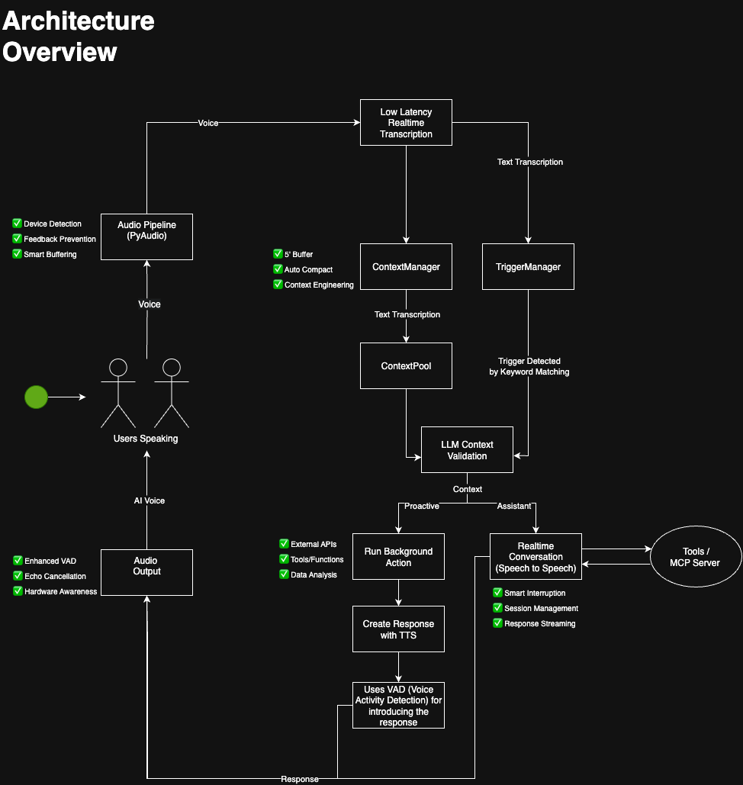
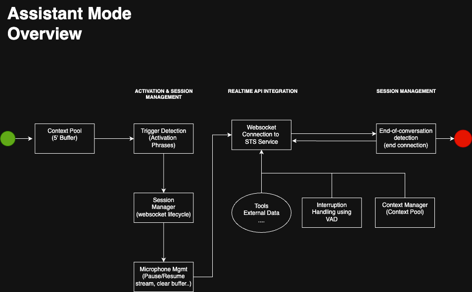
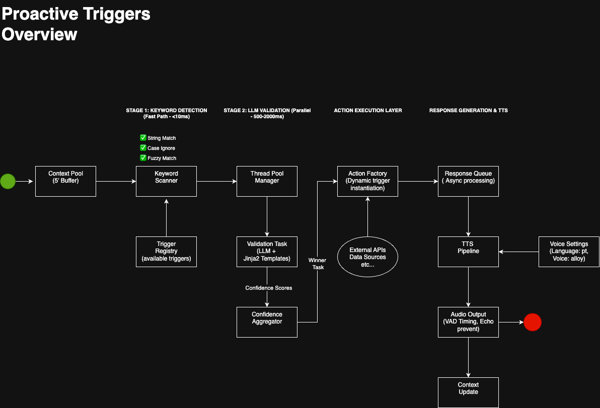

# Always On AI

## 🧐 O que é?

**Always On AI** é um sistema de IA que participa de todas as reuniões da empresa, age como um **sócio digital inteligente**, e transforma cada conversa em **decisões mais rápidas, embasadas e produtivas**.

Não é só mais um _notetaker_. Ele entende o que está sendo falado, **busca dados internos e externos em tempo real**, e pode agir por conta própria para **acelerar decisões, corrigir erros e gerar insights de impacto**.

---

## 🔧 Dois Modos de Operação

### 🧑‍💼 1. Assistant Mode (Precisa ser acionada)

~ Durante discussão para decisão estratégica.

> “Hey Sócio, o que acha sobre isso?”

Nesse modo, a IA é **ativada por uma frase** e pode responder a qualquer pergunta com base no **contexto da reunião e nos dados da empresa**.

#### Como funciona:

- Escuta ativa com buffer de 5 minutos
- Frase de ativação → `"Fala Sócio"`
- Abre sessão via WebSocket (Speech to Speech)
- Acessa dados internos (CRM, Docs, etc.)
- Responde por voz e fecha sessão automaticamente

#### Exemplo real:

Suponha que estamos discutindo qual oferta será feita para a audiência do Adapta Summit. Ou seja, qual o melhor produto e melhor pitch a ser feito.

> “Fala sócio, o que acha sobre isso?”

A IA já tem o contexto do que está sendo discutido, acessa **HubSpot (CRM)** para entender o público do evento, mapeia as principais dores daquela persona, confere documentações sobre seus produtos no Notion, e dá a **resposta final para decisão em segundos com insights valiosos**.

---

### ⚡ 2. Proactive Triggers (Gatilhos proativos)

> A IA entra na conversa **mesmo sem ser chamada**.

Ela detecta **palavras-chave importantes**, valida se é o momento certo de agir, e **age proativamente** trazendo **informações, alertas ou correções**.

#### Como funciona:

- Escaneia tudo que está sendo dito (<10ms)
- Detecta keywords relevantes
- Valida com LLM se é útil agir
- Executa ação (dados, API, cálculo)
- Fala com naturalidade no momento certo e em real-time.

#### Exemplo:

Alguém do comercial diz:

> “... creio que empresas de tecnologia representam muito pouco do nosso faturamento.”

→ A IA confere o CRM, analisa esse dado e responde:

> “Na verdade, empresas de tecnologia representam 33%, o que é uma parcela expressiva.”

---

## 🚀 Diferenciais do Produto

- ✅ **Contexto sempre presente**: Recentemente, muito tem se falado sobre **Context Engineering**.
- 🔌 **Integração plug-and-play**: a AlwaysOn só precisa ser configurada 1x, minimizando a fricção de uso por usuários.
- 🔁 **Atuação reativa + proativa**
- 💸 **Redução extrema de custo por sessão** (de ~US$300/h para ~US$3/h): A arquitetura combina Text-to-Speech (TTS) com Speech-to-Speech, otimizando custos ao manter a IA principalmente em modo de escuta e falando apenas quando necessário.
- 📈 **Base escalável** com foco em multi-times, multi-canais e multi-setores

---

## 🔭 Roadmap de Evolução

### ✅ Já entregue:

- IA funcional
- Modo reativo e proativo
- Integrações com HubSpot (CRM) + Notion (Docs internas)
- Arquitetura de custo otimizado

### 🔜 Próximas etapas:

- Autenticação e suporte multi-equipe
- Novas integrações: Google Meet, Slack, Teams...
- Analytics de produtividade
- Dashboard executivo
- Suporte multimodal (vídeo, docs, tela...)
- Workflows customizados por setor
- Marketplace de agentes especializados

---

## 📋 Pré-requisitos

Para executar o Always On AI, você precisará:

- **Python 3.8+** instalado
- **Node.js 16+** e **npm** (para o dashboard)
- **PyAudio** (requer dependências do sistema)
- **API Key da OpenAI** configurada

### Instalação de Dependências do Sistema

#### macOS
```bash
brew install portaudio
```

#### Ubuntu/Debian
```bash
sudo apt-get update
sudo apt-get install portaudio19-dev python3-pyaudio
```

#### Windows
PyAudio geralmente funciona sem instalações adicionais no Windows.

---

## 🚀 Como Executar

### Início Rápido (Com Dashboard)

A maneira mais fácil de executar o sistema completo:

```bash
# Clone o repositório
git clone https://github.com/your-repo/always-on-ai.git
cd always-on-ai

# Configure as variáveis de ambiente
cp .env.example .env
# Edite .env e adicione sua OPENAI_API_KEY

# Instale as dependências Python
pip install -r requirements.txt

# Execute com dashboard
./scripts/run_with_dashboard.sh
```

O sistema estará disponível em:
- **Dashboard**: http://localhost:3000
- **WebSocket Context**: ws://localhost:8765
- **API REST**: http://localhost:8766

### Executando Componentes Separadamente

#### 1. Apenas o Assistente de Voz
```bash
python main.py
```

#### 2. Apenas o Dashboard
```bash
cd dashboard
npm install
npm run dev
```

#### 3. Com Script Python (Alternativo)
```bash
python scripts/run_with_dashboard.py
```

### Configurações de Execução

O sistema pode ser configurado através de variáveis de ambiente ou editando `config.py`:

- **Modo de Transcrição**: Configurável entre tempo real ou batch
- **Triggers Ativos**: Habilite/desabilite triggers específicos
- **Integrações**: Configure APIs externas (HubSpot, Notion, etc.)

---

## 🏗️ Arquitetura

### Visão Geral da Arquitetura



O Always On AI possui uma arquitetura modular e escalável que processa áudio em tempo real:

1. **Pipeline de Áudio (PyAudio)**:
   - Captura de voz com detecção de dispositivo
   - Prevenção de feedback inteligente
   - Smart buffering para contexto

2. **Transcrição em Tempo Real**:
   - Low Latency Realtime Transcription
   - Context Pool para manter últimos 5 minutos
   - Trigger Manager para detecção de palavras-chave

3. **Validação e Execução**:
   - LLM Context Validation para relevância
   - Action Factory para executar ações
   - Tools/MCP Server para integrações externas

4. **Resposta por Voz**:
   - TTS Pipeline para síntese de voz
   - VAD (Voice Activity Detection) para timing natural
   - Session management para controle de conversas

### Modo Assistant



O Modo Assistant é ativado por frases de ativação ("Fala Sócio"):

1. **Ativação e Gerenciamento de Sessão**:
   - Context Pool mantém buffer de 5 minutos
   - Detecção de trigger abre websocket
   - Session Manager controla lifecycle

2. **Integração com API Realtime**:
   - Conexão WebSocket com OpenAI
   - Tools para acesso a dados externos
   - Interruption handling com VAD

3. **Gerenciamento de Sessão**:
   - Detecção automática de fim de conversa
   - Context Manager preserva histórico
   - Microphone muting durante respostas

### Proactive Triggers



Sistema de gatilhos proativos em 4 estágios:

1. **Stage 1: Detecção de Keywords (<10ms)**:
   - String Match, Case Ignore, Fuzzy Match
   - Keyword Scanner ultra-rápido
   - Trigger Registry com gatilhos disponíveis

2. **Stage 2: Validação LLM (500-2000ms)**:
   - Thread Pool Manager paralelo
   - Validation Task com templates Jinja2
   - Confidence Scores e Aggregator

3. **Stage 3: Execução de Ações**:
   - Action Factory dinâmica
   - APIs externas (HubSpot, Notion, etc.)
   - Data enrichment em tempo real

4. **Stage 4: Geração de Resposta e TTS**:
   - Response Queue assíncrona
   - TTS Pipeline otimizado
   - Audio Output com timing natural

---

## 📁 Estrutura do Projeto

```
always-on-ai/
├── audio/                    # Pipeline de captura e processamento de áudio
│   ├── audio_stream.py      # Gerenciador de stream de áudio
│   ├── conversation_handler.py  # Controle de conversas
│   └── device_detector.py   # Detecção inteligente de dispositivos
├── context/                 # Gerenciamento de contexto e persistência
│   ├── manager.py          # Context Manager principal
│   ├── websocket_server.py # Servidor WebSocket para dashboard
│   └── rest_api.py         # API REST para consultas
├── conversation/            # Gerenciamento de sessões Realtime API
│   ├── realtime_conversation.py  # Cliente WebSocket OpenAI
│   └── session.py          # Controle de sessões
├── core/                   # Componentes centrais do sistema
│   ├── config_validator.py # Validação de configurações
│   ├── logging_config.py   # Sistema de logs
│   └── security.py         # Segurança e autenticação
├── dashboard/              # Interface web React
│   ├── src/components/     # Componentes React
│   └── package.json        # Dependências Node.js
├── realtime/               # Integração com OpenAI Realtime API
│   ├── audio_handler.py    # Processamento de áudio
│   ├── session_manager.py  # Gerenciamento de sessões
│   └── tools/              # Ferramentas disponíveis
├── transcription/          # Transcrição de voz para texto
│   └── simple_transcriber.py  # Transcritor em tempo real
├── triggers/               # Sistema de gatilhos
│   ├── manager.py          # Gerenciador de triggers
│   ├── builtin/            # Triggers pré-construídos
│   └── pipeline.py         # Pipeline de execução
├── tts/                    # Text-to-Speech
│   ├── openai_tts_simple.py  # Integração OpenAI TTS
│   └── audio_output.py     # Saída de áudio
├── main.py                 # Ponto de entrada principal
├── config.py               # Configurações globais
└── requirements.txt        # Dependências Python
```

### Componentes Principais

- **Audio Pipeline**: Captura e processa áudio em tempo real com detecção de dispositivos
- **Context Manager**: Mantém contexto de conversas com persistência e acesso via API
- **Trigger System**: Sistema extensível de gatilhos com validação LLM
- **Realtime Integration**: Cliente WebSocket para OpenAI Realtime API
- **Dashboard**: Interface React para monitoramento e controle

---

## ⚙️ Configuração

### Variáveis de Ambiente

Crie um arquivo `.env` na raiz do projeto:

```env
# OpenAI API Key (obrigatório)
OPENAI_API_KEY=sk-...

# Integrações opcionais
GOOGLE_API_KEY=...              # Para pesquisa Google
GOOGLE_SEARCH_ENGINE_ID=...     # ID do motor de busca
HUBSPOT_ANALYSIS_URL=...        # URL da API HubSpot
```

### Arquivo de Configuração Principal

O arquivo `config.py` contém todas as configurações do sistema:

```python
# Configurações de áudio
AUDIO_CONFIG = {
    "sample_rate": 16000,
    "channels": 1,
    "chunk_duration_ms": 100
}

# Configurações de triggers
TRIGGER_CONFIG = {
    "enabled": True,
    "validation_timeout": 5.0,
    "confidence_threshold": 0.7
}

# Configurações do dashboard
DASHBOARD_CONFIG = {
    "host": "localhost",
    "port": 3000
}
```

### Configurando Novos Triggers

Para adicionar novos gatilhos proativos:

1. Crie um arquivo em `triggers/builtin/`
2. Herde da classe `BaseTrigger`
3. Configure palavras-chave e lógica de execução
4. Registre no `TriggerManager`

Exemplo:
```python
class MeuTrigger(BaseTrigger):
    keywords = ["palavra-chave"]
    
    async def execute(self, context):
        # Sua lógica aqui
        return "Resposta do trigger"
```

### Logs e Monitoramento

Os logs são salvos em:
- `logs/voice_assistant.log` - Log principal
- `logs/errors.log` - Apenas erros

Configure o nível de log em `config.py`:
```python
LOGGING_CONFIG = {
    "level": "INFO",  # DEBUG, INFO, WARNING, ERROR
    "format": "detailed"
}
```

---

## 🤝 Contribuindo

Contribuições são bem-vindas! Por favor:

1. Fork o projeto
2. Crie uma branch para sua feature (`git checkout -b feature/AmazingFeature`)
3. Commit suas mudanças (`git commit -m 'Add some AmazingFeature'`)
4. Push para a branch (`git push origin feature/AmazingFeature`)
5. Abra um Pull Request

---

## 📄 Licença

Este projeto está sob a licença MIT. Veja o arquivo `LICENSE` para mais detalhes.

---

## 📞 Contato

Para dúvidas ou sugestões sobre o Always On AI, entre em contato através dos canais oficiais da empresa.
